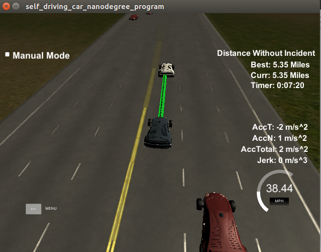

# CarND-Path-Planning-Project
## Michael DeFilippo



#### Please see my [project code](https://github.com/mikedef/CarND-Path-Planning-Project) for any questions regarding implementation.
---

# Overview
This repository contains all the code needed to complete the final project for the Path-Planning course in Udacity's Self-Driving Car Nanodegree.
   
### Simulator.
You can download the Term3 Simulator which contains the Path Planning Project from the [releases tab (https://github.com/udacity/self-driving-car-sim/releases/tag/T3_v1.2).

### Goals
In this project your goal is to safely navigate around a virtual highway with other traffic that is driving +-10 MPH of the 50 MPH speed limit. You will be provided the car's localization and sensor fusion data, there is also a sparse map list of waypoints around the highway. The car should try to go as close as possible to the 50 MPH speed limit, which means passing slower traffic when possible, note that other cars will try to change lanes too. The car should avoid hitting other cars at all cost as well as driving inside of the marked road lanes at all times, unless going from one lane to another. The car should be able to make one complete loop around the 6946m highway. Since the car is trying to go 50 MPH, it should take a little over 5 minutes to complete 1 loop. Also the car should not experience total acceleration over 10 m/s^2 and jerk that is greater than 10 m/s^3.

#### The map of the highway is in data/highway_map.txt
Each waypoint in the list contains  [x,y,s,dx,dy] values. x and y are the waypoint's map coordinate position, the s value is the distance along the road to get to that waypoint in meters, the dx and dy values define the unit normal vector pointing outward of the highway loop.

The highway's waypoints loop around so the frenet s value, distance along the road, goes from 0 to 6945.554.

## Basic Build Instructions

1. Clone this repo.
2. Make a build directory: `mkdir build && cd build`
3. Compile: `cmake .. && make`
4. Run it: `./path_planning`.

Here is the data provided from the Simulator to the C++ Program

#### Main car's localization Data (No Noise)

["x"] The car's x position in map coordinates

["y"] The car's y position in map coordinates

["s"] The car's s position in frenet coordinates

["d"] The car's d position in frenet coordinates

["yaw"] The car's yaw angle in the map

["speed"] The car's speed in MPH

#### Previous path data given to the Planner

//Note: Return the previous list but with processed points removed, can be a nice tool to show how far along
the path has processed since last time. 

["previous_path_x"] The previous list of x points previously given to the simulator

["previous_path_y"] The previous list of y points previously given to the simulator

#### Previous path's end s and d values 

["end_path_s"] The previous list's last point's frenet s value

["end_path_d"] The previous list's last point's frenet d value

#### Sensor Fusion Data, a list of all other car's attributes on the same side of the road. (No Noise)

["sensor_fusion"] A 2d vector of cars and then that car's [car's unique ID, car's x position in map coordinates, car's y position in map coordinates, car's x velocity in m/s, car's y velocity in m/s, car's s position in frenet coordinates, car's d position in frenet coordinates. 

## Details

1. The car uses a perfect controller and will visit every (x,y) point it recieves in the list every .02 seconds. The units for the (x,y) points are in meters and the spacing of the points determines the speed of the car. The vector going from a point to the next point in the list dictates the angle of the car. Acceleration both in the tangential and normal directions is measured along with the jerk, the rate of change of total Acceleration. The (x,y) point paths that the planner recieves should not have a total acceleration that goes over 10 m/s^2, also the jerk should not go over 50 m/s^3. (NOTE: As this is BETA, these requirements might change. Also currently jerk is over a .02 second interval, it would probably be better to average total acceleration over 1 second and measure jerk from that.

2. There will be some latency between the simulator running and the path planner returning a path, with optimized code usually its not very long maybe just 1-3 time steps. During this delay the simulator will continue using points that it was last given, because of this its a good idea to store the last points you have used so you can have a smooth transition. previous_path_x, and previous_path_y can be helpful for this transition since they show the last points given to the simulator controller with the processed points already removed. You would either return a path that extends this previous path or make sure to create a new path that has a smooth transition with this last path.

## Tips

A really helpful resource for doing this project and creating smooth trajectories was using http://kluge.in-chemnitz.de/opensource/spline/, the spline function is in a single hearder file is really easy to use.

---

## Dependencies

* cmake >= 3.5
  * All OSes: [click here for installation instructions](https://cmake.org/install/)
* make >= 4.1
  * Linux: make is installed by default on most Linux distros
  * Mac: [install Xcode command line tools to get make](https://developer.apple.com/xcode/features/)
  * Windows: [Click here for installation instructions](http://gnuwin32.sourceforge.net/packages/make.htm)
* gcc/g++ >= 5.4
  * Linux: gcc / g++ is installed by default on most Linux distros
  * Mac: same deal as make - [install Xcode command line tools]((https://developer.apple.com/xcode/features/)
  * Windows: recommend using [MinGW](http://www.mingw.org/)
* [uWebSockets](https://github.com/uWebSockets/uWebSockets)
  * Run either `install-mac.sh` or `install-ubuntu.sh`.
  * If you install from source, checkout to commit `e94b6e1`, i.e.
    ```
    git clone https://github.com/uWebSockets/uWebSockets 
    cd uWebSockets
    git checkout e94b6e1
    ```


## Project Instructions and Rubric

### Compilation
#### Compiles Using CMake
The code compiles using `cmake`. An additional file was added to my project in `/src`. This is the [spline.h](http://kluge.in-chemnitz.de/opensource/spline/) file which allows the use of splines instead of polynomials. The use of splines was recomended by the instructors in the QA video. Using a cubic spline helped with determining a smooth path while changing lanes. 

### Valid Trajectories 
#### The car is able to drive at least 4.32 miles without incident.
The top right screen of the simulator shows the current/best miles driven without incident. Incidents include exceeding acceleration/jerk/speed, collision, and driving outside of the lanes. Each incident case is also listed below in more detail.

I was able to autonomously drive the car in the simulator for over 5 miles with no collisions. See picture at the top of the README file. 

### The car drives according to the speed limit.
The car was able to drive in accordance to the speed limit. The only time the car would slow down was if there was traffic directly in the cars path, and there was no safe way to move into another lane. 

### Max Acceleration and Jerk are not Exceeded.
I was able to limit the amount of Jerk and Acceleration experienced by the vehicle by ramping and decelerating the car by less than 5 m/s either up to a max speed, or based off if there was a vehicle within 30 meteres fo the ego vehicle. 

### Car does not have collisions.
The car did not experience any collisions. 

### The car stays in its lane, except for the time between changing lanes.
The car stays in it's lane except for lane changes, otherwise the car stays in one of the three lanes on the right side of the road. 

### The car is able to change lanes
The car is able to change lanes smoothly when there are no other cars in the direct path of the lane that the vehicle is changing into. 

## Reflection
The path planning project was a very involved project. The project walkthrough and Q&A was extremely helpful and it would have taken many more days to complete the project if this video and sample code was not provide. 
The simulation provides telemetry and sensor fusion data to work readily work with. Using this data I was able to extract the position of the cars around the ego vehicle and make the appropriate decision based on this data. If a car is within 30 m in front of the ego vehicle I would consider this an obstruction and make a decision. The three decisions to make are one, should the ego vehicle change lane left?  Two, should the ego vehicle change lane right? Or three, should the ego vehicle slow down and stay in the lane. Based on the prediction the code will perform a safe lane change or slow down and stay in the lane untile there is a safe lane change available. The ego vehicle's preference is to always be in the middle lane, then to change lane left, then to change lane right, or lastly to stay in the current lane and slow down. The trajectory is determined using the spline library.   

### Path-Planning Video
Please see the project video of my vehicle going around the track and avoiding vehicles [here](https://youtu.be/RRx7Yj0-oqo). 
